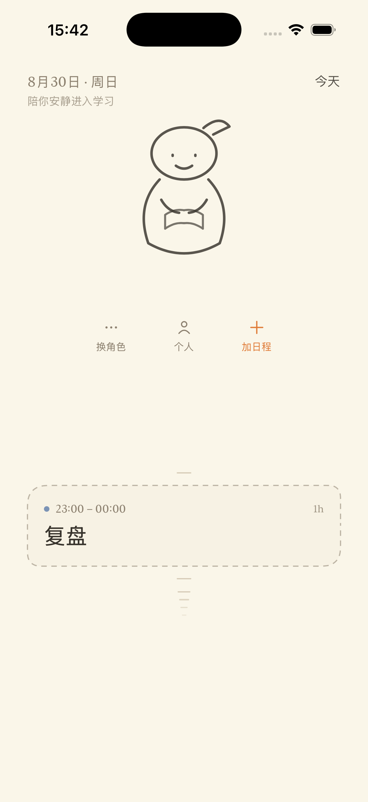
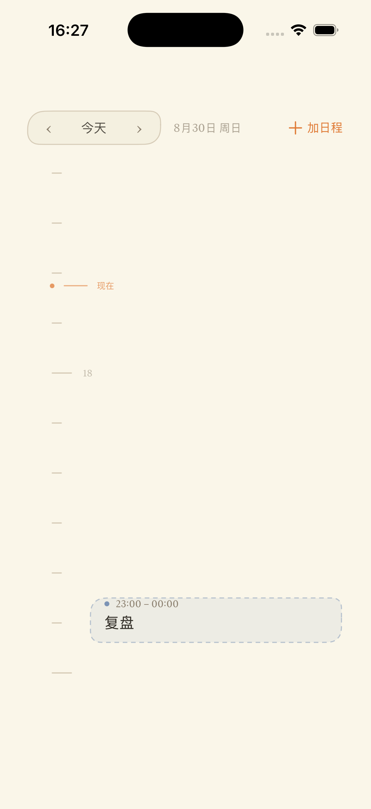
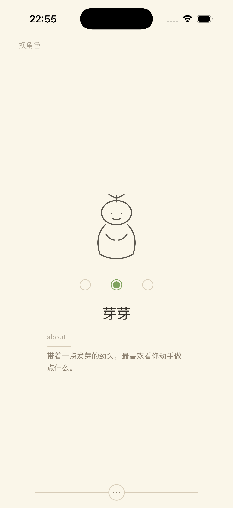
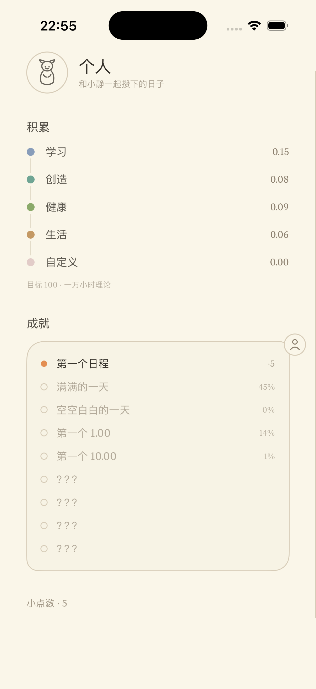

# Schedule with you · 时间速写本

> 一本会呼吸的数字速写本：时间、习惯，和一个小小的陪伴者一起安静生长。

这不是一个日程管理工具。它不想让你"更好地管理时间"，而是想让时间变成可以被温柔地看见、触摸、积累和回忆的东西。

完整的产品哲学与实现纪律见 [CONSTITUTION.md](CONSTITUTION.md)——它是这个项目的最高依据。

## 四个核心想法

- **时间应该可感** —— 一天被表现成空间，而不是一列文字字段
- **规划应该轻量** —— 故意的模糊：问的不是"15:30 必须完成什么"，而是"今天下午要度过什么样的时间"
- **成长来自积累** —— 每小时 +0.01 经验，目标 100（一万小时理论）。时间留下痕迹，仅此而已
- **有生命，但不索取注意力** —— 陪伴者不是宠物：不喂食、不会不开心、不施压

## 现在有什么（demo 阶段）

- **首页**：陪伴者（随当前日程做相关的事，空档发呆，偶尔"去散步了"）、当前 / 上一个 / 下一个日程、有流动感的短横刻度——全局没有格子线，只有米白纸面和文字
- **小时间轴原地展开**：首页下方的小时间轴就是 24 小时视图的种子，点它或带力度上滑，视图从小时间轴的位置原地展开（几何匹配动画），自动对准"现在"；滚回顶部再下拉一次，缩回原位
- **三个抽屉**：换角色（从左）、个人（从上）、加日程（从右）——抽屉只出 95%，露出的原界面模糊处理；进入只允许点击，退出靠反向滑动或页缘把手
- **加日程两条路**：「拖动确定」把粗块拖到时间点上，「输入确定」用转轮定时刻；分类体系（学习/创造/健康/生活 + 自定义）完全数据驱动，随时可改
- **经验系统**：日程结束自动积累，不需要点"完成"；"还不错 ×1.2"是结束后的可选项，不点也不少——自我认可是一份礼物，不是又一个任务
- **成就**：观察而非目标——一半是长期记忆（第一个日程、第一个 1.00），一半是无厘头彩蛋（未解锁只显示"？？？"），防刷设计
- **本地持久化**：日程、经验、自定义分类、角色选择，重启不丢

## 截图

| 首页 | 小时间轴展开 |
| --- | --- |
|  |  |

| 换角色 | 个人 · 积累与成就 |
| --- | --- |
|  |  |

## 构建运行

- Xcode 26.3+，iOS 18+，纯 SwiftUI，零第三方依赖
- 克隆后打开 `Schedule with you.xcodeproj`，选一台 iPhone 模拟器或真机，Run

## 路线图

按宪法 §31 的阶段推进，先保证"感觉"对了再加复杂度：

1. **Phase 2 · 时间交互** —— 拖块放置手感打磨、块边缘拖拽调时长、任意日期
2. **Phase 4 · 世界** —— 点数解锁新陪伴者与新动画、更多彩蛋成就
3. **Phase 5 · 打磨** —— 触感与音效、Dynamic Type、减少动态支持、边界情况
